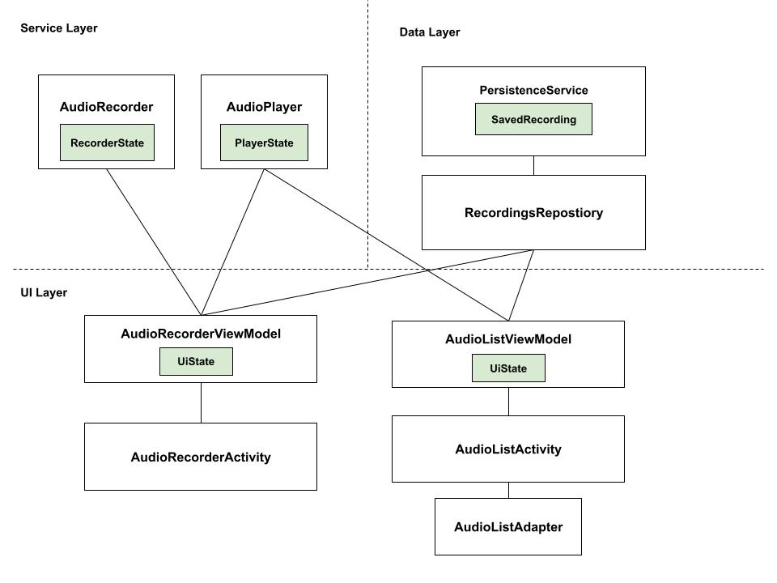

# Dictaphone Project

This project implements the requiremet for the coding exercise for Dictaphone project

## Requirements
Please ensure your build environment supports the following:

- JDK 11
- Kotlin 1.9.2
- Android Gradle Plugin 8.1.4
- Android SDK 34


## Project Architecture Overview
 *Diagram showing the relationship between app components*

The project has been implemented using Unidirectional Data Flow pattern. In nutshell, each component maintain its own observable data state. 
Components which are interested in interacting with any other component can send events upstream. Likewise, they can observe to other components state and react accordingly for any updates.

This design has been used avoid tigh coupling and provide flexibility of providing multiple implementations.

Below is brief description of main components.


#### Notes 
- Provisioning, managing the relationship and maintaining the scoping of the components are managed using Hilt dependency injection. 
- **Note**: It's generally recomendded to always write an interface (API) for the components in Data & Service layers, then provide the concrete implementation during dependency injection. However, to keep the code simple I have only written concrete implementations without defining interfaces
- RxJava has been used as the primary method to implement observable data state which travels downstream 

## Data Layer [com.dictaphone.android.data]
**All components in this layer are Application Scoped**

- **PersistenceService** Provide ability to store and lookup data locally. This has been implemented using Jetpack Room
- **RecordingsRepository** This component provides CURD access to all locally stored recordings. 

#### Data Models:
- **SavedRecording** An entity model provided by data layer which contains all data related to a saved audio recording 

## Service Layer [com.dictaphone.android.service]

**All components in this layer are Application Scoped**

#### AudioPlayer
Provides simple implementation of audio player which plays a SavedRecording. Interested components can inject this component to play audios anywhere in the app. The component maintains an observable state so other components (e.g. UI)  can observe it:

- ##### Possible states for Audio Player
```kotlin
    sealed class State(val recording: SavedRecording?) {
        data object Idle : State(null)
        class PlayingRecording(recording: SavedRecording) : State(recording)
        class PausedRecording(recording: SavedRecording) : State(recording)
        class FinishedPlaying(recording: SavedRecording) : State(recording)
    }
```

- ##### Available functionalities provided by the player
```
playRecordedAudio(savedRecording: SavedRecording)
pausePlayback()
stopPlaying()
```
- ##### Notes:
 - If you call playRecordedAudio while the AudioPlayer is already playing another Audio, the AudioPlayer will stop existing playback and play the newly requested recording
 - If you call playRecordedAudio while the player is already playing the same recording, it will actualy *pause* the audio (In retrospect, method could've been better named to avoid confusion)
 - To resume playing the audio, you can call playRecordedAudio again. 
 - For simplicity this has been implemented using MediaPlayer (as opposed to ExoPlayer), also used synchronous calls for same reason.

#### AudioRecorder
Provides simple implementation of audio recoder which captures a recorded audio. Interested components can inject this component to record audio. The component maintains an observable state so other components (e.g. UI)  can observe it:

- ##### Possible states for Audio Recorder
```kotlin
    sealed class RecorderState {
        data class Idle(val recordingComplete: Boolean = false) : RecorderState()
        data object Recording : RecorderState()
        data object Playing : RecorderState()
    }
```

- ##### Available functionalities provided by the player
```
startRecording()
stopRecording()
playRecordingPreview()
stopPlayingRecordingPreview()
saveRecording(): SavedRecording?
```
- ##### Notes:
 - The methods are self-explanatory. 
 - saveRecording returns SavedRecording data model containing the file location of saved audio file
 - However, it DOES NOT store the model in the database, since that's not the job of this service (to store it use RecordingsRepository explained above)
 - If you call playRecordedAudio while the player is already playing the same recording, it will actualy *pause* the audio (In retrospect, method could've been better named to avoid confusion)


## UI Layer [com.dictaphone.android.ui]

The UI layer is written using standard MVVM pattern. All components here are Activity Scoped

- Each UI surface has its own ViewModel which maintains a UiState observable object. 
- The actual UI surface (View) is implemented as an Activity which observes its ViewModel UiState and update the UI based on state changes
- Views can send events upstream to the ViewModel based on user events
- This approach could have been also be based on using Fragments for View. However since there is no apparent relation between the two UI surfaces, I opted to use activities.


### Audio List UI
This surface basically shows list of all recordings already saved by user

- **AudioListViewModel**
 - Manages the state of the Audio List UI
 - Fetches list of recordings using **RecordingsRepository**
 - Handle play/pause events by using AudioPlayer component
 - Manages continuous playback queue (This could have been implemented somewhere in domain layer, see last section for details)

 - Possible states:

 ```kotlin
    data class UiState(
        val recordingsList: List<SavedRecording> = emptyList(),
        val audioPlayerState: AudioPlayer.State = AudioPlayer.State.Idle
    )
```
 - Available event calls:

 ```kotlin
	 playRecording(recording: SavedRecording)
	 pausePlaying()
 ```
- **AudioListActivity**
 - Observes UI state provided by *AudioListViewModel*
 - Renders audio list view using *AudioListAdapter*
 - Relays user play/pause events upstream to the ViewModel

### Audio Recording UI

- **AudioRecorderViewModel**
 - Manages the state of the Audio recording UI
 - Handle record/play & pause preview user events using **AudioRecorder**
 - Handles save user event by using **RecordingsRepository**
 - Possible states:

 ```kotlin
      data class UiState(
        val isRecording: Boolean = false,
        val previewAvailable: Boolean = false,
        val isPlayingPreview: Boolean = false,
        val isDismissed: Boolean = false
    )
```
 - Available event calls:

 ```kotlin
	 doRecord()
	 stopRecord()
	 playPreview()
	 stopPreview()
	 saveRecording()
	 dismissView()
 ```

- **AudioRecorderActivity**
 - Observes UI state provided by *AudioRecorderViewModel*
 - Relays user events upstream to the ViewModel


## What's Missing:

There are few things I would have preferred to implement, but I didn't mainly to keep the project is simple and avoid spending more time than I need. Those things are not necessary for small scale apps, but they becamse very important as the app grows

**Domain Layer component to manage Audio Recording & Playback relationship**

Currently you may notice AudioRecorder & AudioPlayer are being injected directly to the ViewModel. There are some scenarios where a state change in AudioRecorder should trigger an event to AudioPlayer (for example if user records audio while the app is already playing a recording, it should stop that recording). This logic is being handled by the ViewModel. However it's better to have a component that handle this relationship between the components

**Leverage Jetpack Media3**

For simplicity the app just plays the audios using MediaPlayer. However, since the app is playing a list of audios continuously, it app should advertise its playback to the platform and maintain media session. This is important to handle cases such as when user receives a phone call during playback, the app should automatically pause the playback.

**Error States**

Errors such as IO are currently being handled silently. However, those states should be clearly defined and handled (e,g. error recovery or display UI error state)


